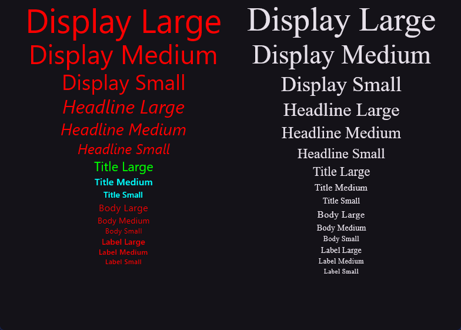

# Extended MaterialTheme

[](https://kotlinlang.org/)
[](https://www.jetbrains.com/lp/compose-multiplatform/)

## What is it?

Some utils to help you use `MaterialTheme` more easily.

Completely invisible to other content using `MaterialTheme`

## ExtendedMaterialTheme Object

### Typography

```kotlin
// MaterialTheme style
textStyle = MaterialTheme.typography.headlineLargeEmphasied
textStyle = MaterialTheme.typography.bodyLarge
textStyle = MaterialTheme.typography.bodyMedium
textStyle = MaterialTheme.typography.bodyLargeEmphasized

// ExtendedMaterialTheme style
textStyle = ExtendedMaterialTheme.typography.headline.largeEmphasized
textStyle = ExtendedMaterialTheme.typography.body(Size.Large)
textStyle = ExtendedMaterialTheme.typography(Type.Body).medium
textStyle = ExtendedMaterialTheme.typography(Type.Body)(Size.Large, emphasized = true)

```

You can even traversal all typographies if you really want (for whatever reason)
```kotlin
@Composable
fun ColumnOfAllTextStyle() {
    Column(
        horizontalAlignment = Alignment.CenterHorizontally,
    ) {
        ExtendedTypography.Type.entries.forEach { entry ->
            TypographyEntry.Size.entries.forEach { size ->
                Text(
                    text = "$entry $size",
                    style = entry(size)
                )
            }
        }
    }
}
```

## ExtendedMaterialTheme Composable

```kotlin
@Composable
fun ExtendedMaterialTheme(
    config: ConfiguredMaterialTheme.() -> Unit = {},
    content: @Composable () -> Unit
)
```

### typography config

An easy way to set style for many typographies

```Kotlin
ExtendedMaterialTheme({
    typography { // for typographies
        color = Color.Red
        title { // for every titleXXX
            color = Color.Cyan
            large { // for only titleLarge
                color = Color.Green
            }
        }
        headline {
            fontStyle = FontStyle.Italic
        }
    }
}) {
    // content
}
```



### animatedColorScheme(ColorScheme)

A simple function that warp every color with `animateColorAsState()`.

A simple way to make theme switching smoother.

